# Setup Guide
본 문서는 Vagrant 환경을 통해 Ansible-Server를 자동 설치하고,
Git Clone으로 프로젝트 코드를 내려받아 실행함으로써 테스트 환경을 재현합니다. 

## 1. 프로젝트 구조

```bash 

/home/vagrant
 ├── tftp_backup/            # 장비별 설정 백업 저장 경로
 │        
 ├── .vault_pass.txt         # Ansible Vault 패스워드 파일
 │
 └── ansible_project/
     ├── playbooks/                       # Ansible 자동화 스크립트
     │   ├── tftp_setup.yml               # TFTP 서버 구축
     │   ├── collect_config.yml           # 수동 백업 (ask-vault-pass 사용)
     │   ├── backup_config.yml            # 자동 백업 (cron, vault-pass 파일 사용)
     │   ├── delete_users.yml             # 지정 사용자 삭제
     │   ├── sync_users.yml               # 운영자 계정 자동 동기화 (삭제/생성)
     │   └── collect_device_details.yml   # 장비 상세 정보 수집
     │   
     ├── inventory/                   # 대상 장비 
     │   ├── hosts.ini                # 장비 접속 정보 
     │   └── host_vars/               # 장비별 암호화 패스워드 파일
     │   
     ├── data/                        # EOS/EOL 데이터 파일     
     │   
     ├── scripts/                     # Python 비교 스크립트
     │   
     ├── docs/                        # 프로젝트 문서 (plan.md, 이미지 등)
     │
	 ├── reports/                     # 자동 생성 리포트 (HTML, JSON)
     │
	 ├── backup.log         # cron 실행 시 Ansible 결과 로그
     ├── ansible.cfg        # Ansible 환경 설정
     └── serve_utf8.py      # UTF-8 웹서버 (리포트 확인용)

	 
  **자동 생성 항목**
  - tftp_backup/ : 장비명 폴더별 백업 파일 자동 생성
  - reports/ : HTML, JSON 리포트 자동 생성
  - backup.log : 자동 백업 실행 로그 기록

```
---

## 2. 설치 환경

- **VirtualBox** : 7.1.10
- **Vagrant** : 2.4.7
- **Ansible-Server** : Ubuntu 18.04 *(Vagrantfile 실행 시 자동 설치)*
- **Ansible** : 2.9.27
- **Python** : 2.7.17 -> 3.6.9 *(Ansible JSON 파싱 호환성 문제로 업그레이드)*
- **NXOSv** : nxosv-final.7.0.3.I7.9.vmdk *(Cisco 공식 다운로드)*
- **브라우저** : Chrome / Whale *(HTML 리포트 확인용)*

---

## 3. 환경 구성 방법

### 1) 테스트 환경 구성

#### (1) VirtualBox 및 Vagrant 설치 
- VirtualBox 설치 (https://www.virtualbox.org/wiki/Download_Old_Builds_7_1)
- Vagrant 설치 (https://developer.hashicorp.com/vagrant)

#### (2) Vagrant 환경 파일 준비
① `ansible_env_ready.yml` 및 `Vagrantfile` 파일을 **C:\Vagrant** 경로로 이동  
② Vagrantfile 수정 (IP, 포트 등 환경에 맞게 조정)

**예시 (수정된 부분):**
```ruby

  config.vm.define "ansible-server-test" do |cfg|
    cfg.vm.network "public_network", ip: "192.168.45.85"
	cfg.vm.network "forwarded_port", guest: 22, host: 19285, auto_correct: true, id: "ssh"
	cfg.vm.provider "virtualbox" do |vb|
	vb.name = "Ansible-Server(TEST)"
	end
  end
```
   
③ PowerShell에서 Vagrant 실행
```bash
cd C:\Vagrant\
vagrant up
```

④ VM 부팅 및 Ansible 설치 확인
- Vagrant SSH를 통해 비밀번호 없이 `vagrant` 계정으로 접속 가능

|  설치 과정  |  스크린샷  |
|------------|-----------|
|  VM 부팅 완료  | 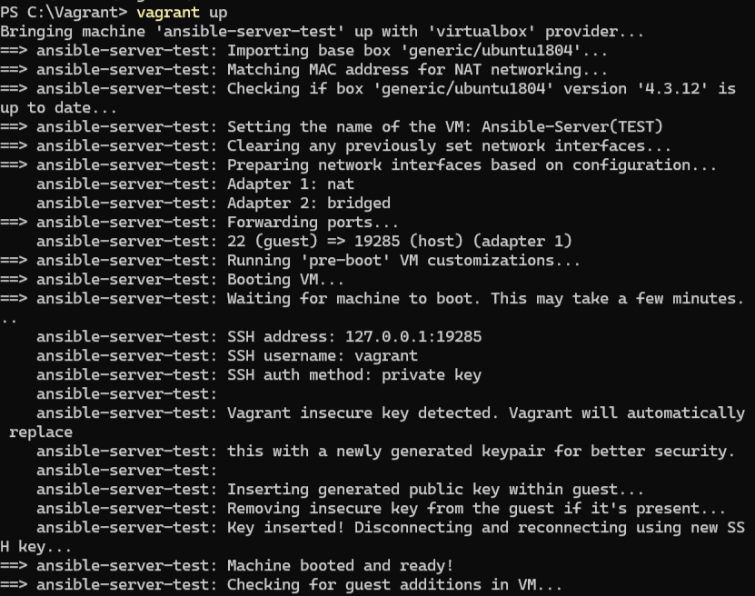 |
| Ansible 설치 완료 | 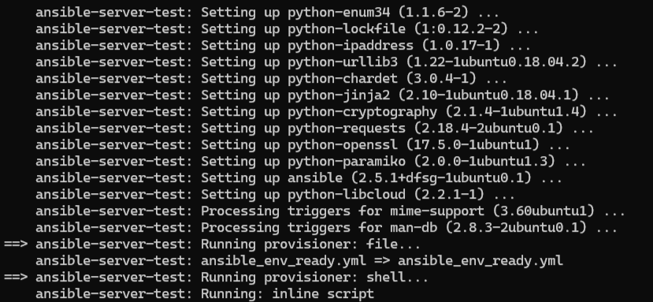 |
| SSH 접속 확인 |  |

---

#### (3) Ansible-Server Python3 설치 
```bash
sudo apt update
sudo apt install -y python3 python3-pip
python3 --version
```

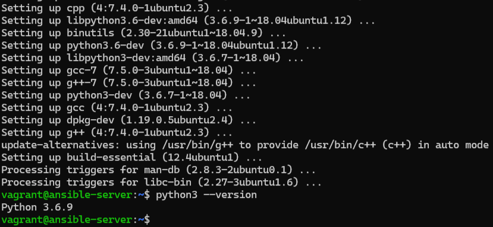

---

#### (4) NXOSv 기본 설정
``` bash 
switch# conf t
switch(config)# hostname nxosv-test01
nxosv-test01(config)# boot nxos bootflash:/nxos.7.0.3.I7.9.bin
nxosv-test01(config)# int mgmt 0
nxosv-test01(config-if)# ip addr 192.168.45.77/24
nxosv-test01(config-if)# no shut
nxosv-test01(config-if)# exit
nxosv-test01(config)# copy run start
```
> NXOSv 이미지를 VirtualBox에 추가 후 실행하고,  
> Ansible-Server와 NXOSv는 동일 네트워크 대역(192.168.45.0/24)으로 설정

--- 

#### (5) 통신 확인
- Ansible-Server에서 NXOSv로 ping 테스트 

```bash
ping 192.168.45.77
```
	
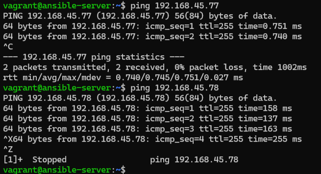

> 본 테스트는 노트북 2대(192.168.45.77, 192.168.45.78)로 진행함  
> ※ 테스트 결과 노트북 메모리 16GB 기준, 1대의 NXOSv만 안정적으로 동작 가능

#### (6) 실행 코드 다운로드
- GitHub 리포지토리에서 실행 코드를 `git clone`명령어로 다운로드

```bash
git clone https://github.com/jina5213/ansible_project.git
```


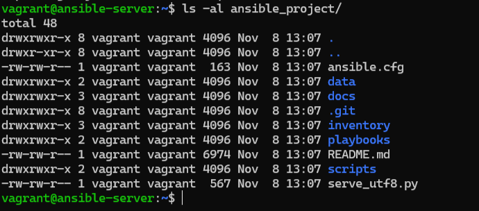

> Ansible-Server의 `/home/vagrant/ansible_project` 경로에 코드를 복제해야
> 이후 playbook 실행 가능

---

## 요약 

| 구분 |   내용   |
|-----|----------|
| 서버 Name | ansible-server-test |
| 서버 IP 주소 | 192.168.45.85 |
| NXOSv Hostname | nxosv-test01, nxosv-test02 |
| NXOSv IP 주소 | 192.168.45.77, 192.168.45.78 |
| 네트워크 대역 | 192.168.45.0/24 | 

---

### 2) 실행 전 필수 설정 
> 아래 항목을 수정하지 않으면 `ansible-playbook` 실행 시 에러가 발생 할 수 있음

---

#### (1) host_vars/<호스트명>.yml 파일 수정 및 암호화
- 장비의 패스워드를 정의하는 파일
- 아래 명령어 실행 시 Vault 암호 입력을 요구하며, 즉시 AES256 방식으로 암호화

**예시:** 
```yaml
ansible_password: "wlskdi123@"
```

```bash
ansible-vault encrypt inventory/host_vars/nxosv-test01.yml
New Vault password:
Confirm New Vault password:
Encryption successful
```

- `$ANSIBLE_VAULT;1.1;AES256` 문자열이 보이면 암호화 완료 
- Vault 암호: `vagrant`

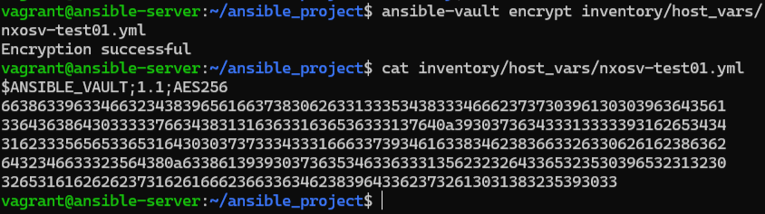

---

#### (2) .vault_pass.txt 파일 생성
- Vault 복호화를 위해 자동화 환경에서 참조하는 암호 파일
- `host_vars/<호스트명>.yml` 암호화 시 사용한 Vault 암호(`vagrant`) 입력

```bash
echo "vagrant" > .vault_pass.txt
```

---

#### (3) hosts.ini 파일 수정
- 장비의 호스트명, IP, 계정, 접속 방식 등을 설정하는 파일

**예시 (수정된 부분):**
```ini
[nxosv]
nxosv-test01 ansible_host=192.168.45.77 ansible_user=admin
nxosv-test02 ansible_host=192.168.45.78 ansible_user=admin
```

---

#### (4) nxos_backup cron 등록
- `/etc/cron.d/nxos_backup` 파일을 생성하여 주기적 백업 자동화

**예시 (10분마다 실행):**
```bash
sudo touch /etc/cron.d/nxos_backup
sudo vi /etc/cron.d/nxos_backup

*/10 * * * * vagrant cd /home/vagrant/ansible_project && ansible-playbook playbooks/backup_config.yml --vault-password-file /home/vagrant/.vault_pass.txt >> /home/vagrant/ansible_project/backup.log 2>&1
```

---

#### (5) TFTP 서버 IP 수정
- TFTP 서버 IP는 `collect_config.yml`, `backup_config.yml` 파일 내에서 실제 환경에 맞게 변경해야 함

---


## 4. 실행 절차 *(Path: `/home/vagrant/ansible_project`)*

### 1) 인벤토리 통신 테스트
- 모든 호스트에서 `pong` 응답 확인 시 통신 정상

```bash
ansible -i inventory/hosts.ini all -m ping --ask-vault-pass
```

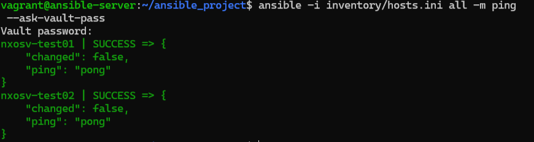

> ※ 에러 발생 시 **5. 트러블슈팅 - (1) SSH 호스트키 미등록** 항목 참고 

### 2) Config 백업
- 수동 백업 결과는 `/home/vagrant/tftp_backup/` 경로에 저장됨
- 장비별 백업 파일은 `/home/vagrant/tftp_backup/<호스트명>/` 하위 경로에 생성됨

```bash
ansible-playbook playbooks/tftp_setup.yml
ansible-playbook playbooks/collect_config.yml --ask-vault-pass
ansible-playbook playbooks/backup_config.yml
```
#### 수동 백업 파일(`<호스트명>-config-bk`) 확인 
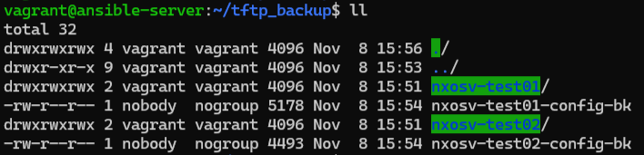

#### 장비별 백업 디렉토리 확인
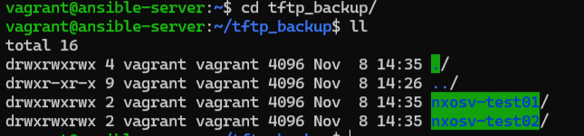

#### 자동 백업 파일(`<호스트명>-<날짜시간>.cfg`) 확인 
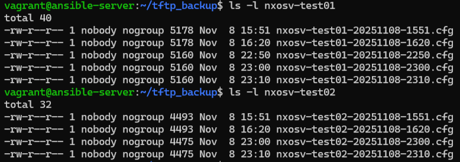

---

### 3) 계정 동기화
- 장비의 사용자 계정을 일괄적으로 삭제하거나 동기화 하는 작업
  - `delete_users.yml` : 삭제 대상 계정 -> `test01`,`test02`,`test03`
  - `sync_users.yml` : 동기화 대상 계정 -> `admin`,`jnkim9`,`test11`
- 테스트를 위해 NXOSv 장비에 해당 계정을 미리 생성해두는 것을 권장함

**예시 (`jnkim9`,`test11`,`test12` 생성):**
```bash
ansible-playbook playbooks/sync_users.yml --ask-vault-pass
```

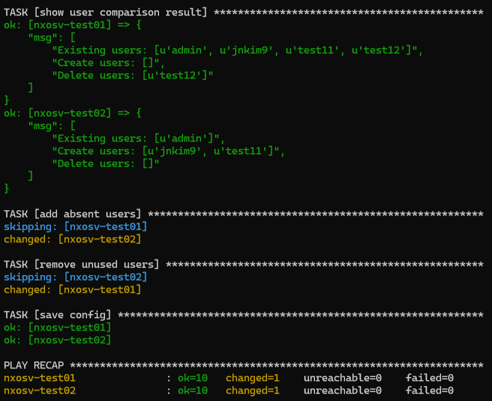

---

### 4) EOS/EOL 리포트
- 장비 별 하드웨어 및 소프트웨어 정보를 JSON 형식으로 저장하여 EOS/EOL 분석에 활용함
- 수집된 정보를 기반으로 장비의 HTML 리포트를 생성하여 시각적으로 확인 가능

```bash 
ansible-playbook playbooks/collect_device_details.yml --ask-vault-pass
python3 scripts/compare_eos.py
python3 serve_utf8.py
# 브라우저 접속: http://<Ansible-Server IP>:8080/reports/eos_report.html
```

#### JSON 리포트 
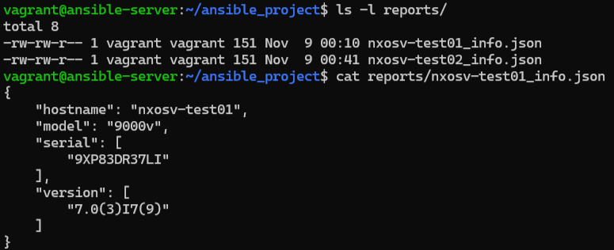

> ※ 에러 발생 시 **5. 트러블슈팅 - (3) 정보 수집 불가** 항목 참고 

#### 웹 서버 실행


#### HTML 리포트


---

### (5) Config 변경 비교
- 장비별 Config 변경 결과를 HTML 리포트로 시각화하여 변경 내역을 한눈에 확인할 수 있음
- Slack Webhook을 연동하면 Config 변경시 자동으로 알림을 받을 수 있음

```bash
python3 scripts/compare_config_diff.py
python3 serve_utf8.py
# 브라우저 접속: http://<Ansible-Server IP>:8080/reports/<호스트명>_config_diff.html
```

#### Python 실행
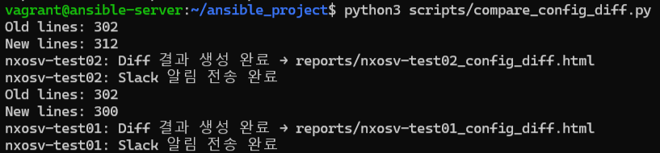

#### HTML 리포트 (`nxosv-test01`)
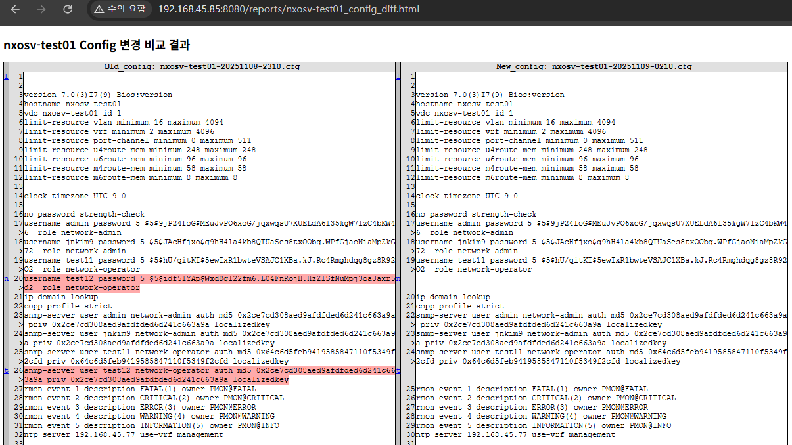

#### HTML 리포트 (`nxosv-test02`)
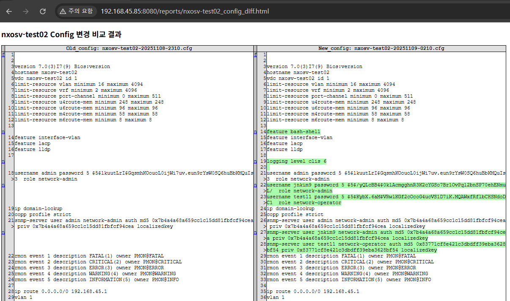

#### Slack 알림 연동
```bash
export SLACK_WEBHOOK_URL="<Slack URL>"
```

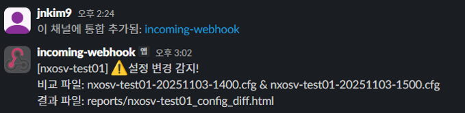

> ※ 환경변수는 현재 세션에만 유효하므로,  
> 지속적으로 사용을 원할 경우.bashrc 또는 .profile에 추가해야 함

---

## 5. 트러블슈팅
### 1) SSH 호스트키 미등록 - 초기 접속 실패
- **증상:** `The authenticity of host 'x.x.x.x' can't be established.` 로그 발생
   - 신뢰되지 않은 서버의 공개키 인증 경고로 playbook 실행 실패
    
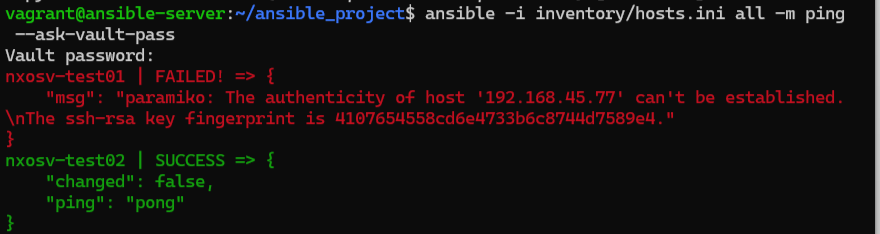

- **원인:** Ansible-Server에서 SSH 접속 시도를 한적이 없어 `~/.ssh/known_hosts` 파일에 NXOSv의 공개키가 등록되지 않음
  - 자동화 환경에서는 `yes` 입력을 수행할 수 없어 인증 실패로 간주
- **해결 방안:** Ansible-Server에서 직접 접속하여 공개키 등록
  
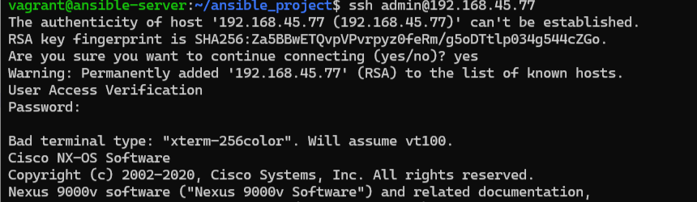

### 2) 백업 파일 미생성 - TFTP 경로 오류
- **증상:** backup.log 확인 시 에러 발생 없고 NXOSv 접속하여 명령어 실행시 정상 
  - 모든 것이 정상인데 백업 파일만 생성되지 않음 
- **원인:** NXOSv에서 파일을 보낼때 /home/vagrant/tftp_backup 폴더로 보내지 않음
- **해결 방안:** tftp_setup.yml 파일에 --chroot 옵션 추가

### 3) 계정 생성 불가 - 비밀번호 정책 위반
- **증상:** `ansible-playbook` 실행 결과는 정상이나 NXOSv 장비에 접속해보면 신규 계정이 생성되지 않음
- **원인:** NXOSv 장비의 패스워드 정책상 최소 8자리 미만의 비밀번호는 허용되지 않음
- **해결 방안:** 사용자 비밀번호를 8자리 이상으로 변경
  
### 4) 정보 수집 불가 - 변수 미정의 오류
- **증상:** `version_info` 변수에 값이 비어있음

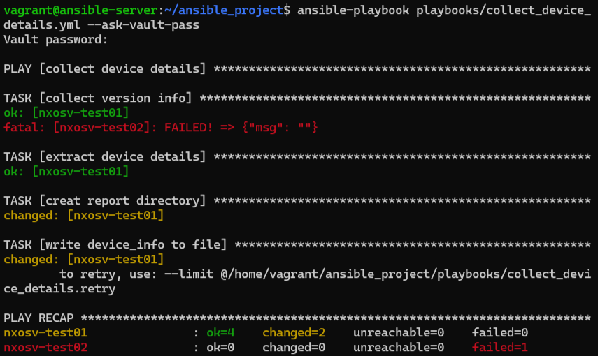

- **확인 사항:** 
  - `ansible nxosv-test02 -m nxos_command -a "commands='show version'"` -> 정상 출력 
  - `ansible nxosv-test02 -m debug -a "var=version_info"` -> 
    `"version_info": "VARIABLE IS NOT DEFINED!"` 출력  
	즉, `version_info` 변수가 playbook 안에서 정의되지 않은 상태
- **원인:** NXOSv 환경에서는 첫 연결 시 버퍼 초기화 지연으로 일시적으로 변수 등록 누락이 생길 수 있음
- **해결 방안:** 동일 명령을 재실행하면 정상적으로 변수 값이 반환됨
 
--- 

> #### **※ 프로젝트 개선 방향 및 세부 구현 내용은 [README.md](README.md) 에서 확인 할 수 있습니다.**

